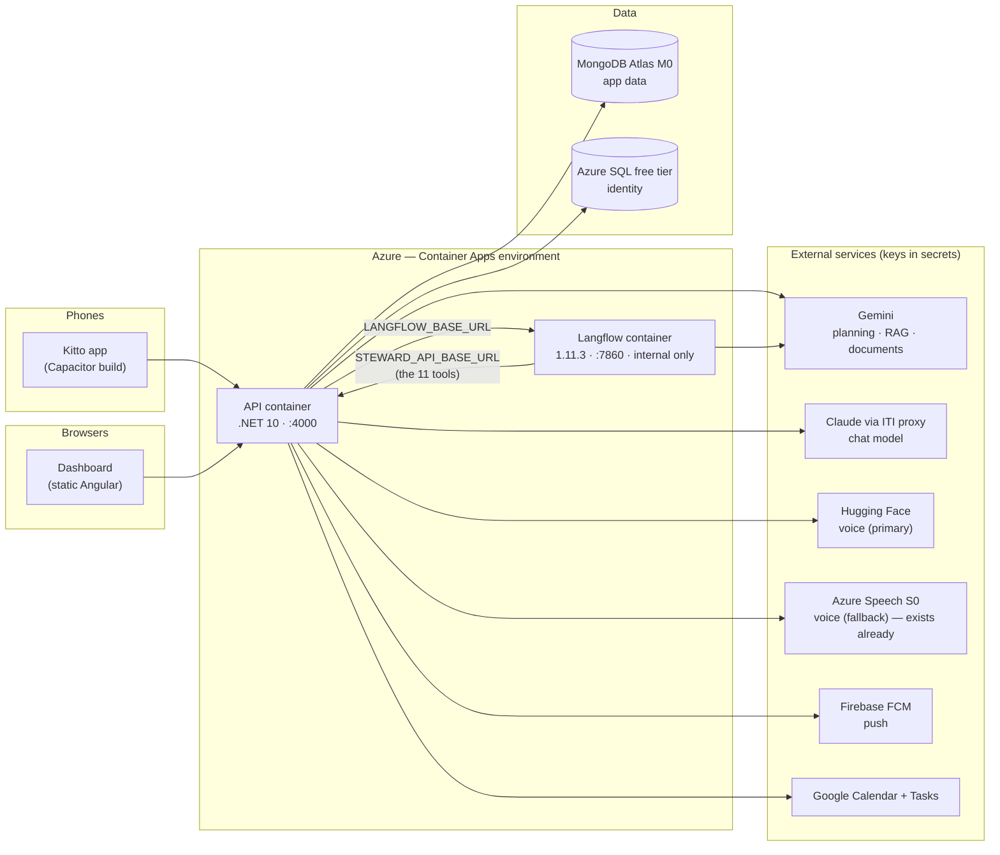
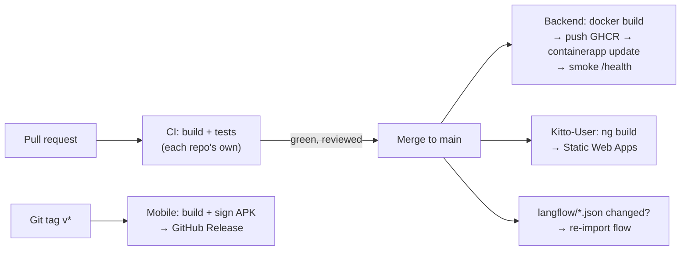

# Deploying Kitto

The plan for taking the stack from `./tools/dev/up.sh` on one laptop to a URL
anyone can open. **Nothing in here has been executed** — this is the map, written
before the journey, for a team that has not deployed before. Execute it when the
product reaches a stable version, in the order of §8, and expect to correct this
document where reality disagrees with it.

Two constraints shaped every choice below:

1. **Money.** The subscription is Azure for Students — $100 of credit a year and
   a set of always-free services, no credit card behind it. The plan spends $0
   on idle months and saves the credit for demo weeks.
2. **Experience.** Nobody on the team has done this before. Where two designs
   tie, the one with fewer moving parts wins, and every step says *why* it
   exists so it can be debugged rather than re-typed.

---

## 0. The shape of the problem

What actually has to exist in production, read off `docker-compose.yml`,
`.env.example` and `docs/RUNNING.md`:

| Piece | Today | In production |
|---|---|---|
| **API** (.NET 10, `:4000`) | `dotnet run`, not containerised | A container. **No Dockerfile exists yet** — writing one is work item G1 |
| **Langflow** (`langflowai/langflow:1.11.3`, `:7860`) | Docker, no auth, flow imported by `tools/dev/langflow-import.sh` | Same pinned image, **with auth turned on**, flow imported against the deployed instance |
| **MongoDB 7** (`:27017`) | Docker volume | A hosted Mongo — Atlas M0 (free) recommended |
| **Identity DB** (SQL) | SQLite file `kitto-dev.db` | Azure SQL free tier — the code already supports both providers |
| **Dashboard** (Angular, Kitto-User repo) | `ng serve :4200` | Static files on a free static host |
| **Mobile** (Next.js + Capacitor) | `next dev :3000` | **Not hosted at all** — it ships as an APK/IPA with `NEXT_PUBLIC_API_URL` baked in at build time |
| `mongo-test` (`:27018`) | Docker | **Never deployed.** CI-only |

Two couplings decide the whole topology, and both are already documented in
`.env.example`:

- **API → Langflow**: the API calls the flow at `LANGFLOW_BASE_URL`.
- **Langflow → API**: the flow's eleven tools call *back* into the API at
  `STEWARD_API_BASE_URL` (locally `host.docker.internal:4000`). Deployed, this
  becomes the API's own URL — get it wrong and chat answers while every tool
  fails, the exact failure mode the `.env.example` comment warns about.



The dashboard's static files come from Azure Static Web Apps and are not drawn
inside the API's box on purpose: nothing but the browser ever touches them.

---

## 1. Decisions, made

Each of these is a fork in the road. The recommendation is what §2 assumes; the
alternatives exist so a different call is a substitution, not a rewrite.

| Decision | Recommendation | Why | The other road |
|---|---|---|---|
| Where the containers run | **Azure Container Apps** | Scale-to-zero fits a $0 idle bill; a real free grant (180k vCPU-s + 360k GiB-s + 2M requests / month); the subscription already exists | One VM running `docker-compose` (§4, Lane B) — simplest to *understand*, but always-on, so it always costs |
| Mongo | **Atlas M0** (free, 512 MB) | It is real MongoDB 7 — the driver, transactions behaviour and query semantics match dev exactly | Cosmos DB for MongoDB — Azure-native, but a *compatibility layer*, and this codebase was ported against real Mongo semantics. Test everything before trusting it |
| Identity DB | **Azure SQL free tier** (serverless, 100k vCore-s + 32 GB / month free) | `Database__Provider=SqlServer` is already a first-class path, and `DatabaseProvider.cs` says SQL Server applies the checked-in migrations — the production-grade route | SQLite on an Azure Files volume — fewer resources, but SQLite over SMB is a known corruption risk. Not worth it to save a free resource |
| Dashboard hosting | **Azure Static Web Apps, Free tier** | Free SSL, custom domain, GitHub Actions integration, PR preview environments | Vercel / Netlify / Cloudflare Pages — equally good, see §4 |
| Container registry | **GHCR** (ghcr.io) | Free for public repos, and all three repos are public. Keep the packages public and Container Apps pulls them with no credentials at all | Azure Container Registry — ~$5/mo for Basic. Pointless expense here |
| Region | **West Europe or Germany West Central** | Atlas M0 must live near the API (every request crosses that link). M0 is only offered in certain Azure regions — pick the API region *after* confirming an M0 region near it. Speech is already in `germanywestcentral` | `uaenorth` (where the resource group lives) is closer to Egypt, but check M0 availability there first — a co-located database beats 100 ms shaved off the browser leg |
| iOS | **Defer** | Requires a $99/yr Apple Developer account and signing ceremony. Android APK covers the demo | Do it when the account exists; the workflow slot is reserved in §5.5 |

---

## 2. The recommended path: Azure, as free as it gets

### 2.1 One-time account work (a human does these once)

1. **MongoDB Atlas** — create a free account at mongodb.com, create an **M0**
   cluster on **Azure** in the region chosen above. Create a database user, and
   under *Network Access* allow `0.0.0.0/0` (Container Apps has no stable
   outbound IP on the free plan; the connection is still TLS + credentials).
   Copy the connection string — it goes in secrets as
   `MongoDbSettings__ConnectionString`, with `MongoDbSettings__DatabaseName`
   staying `LifeAdminAutopilotDB`.
2. **Google OAuth** — in the existing Google Cloud client, register the
   production redirect URI (`https://<api-domain>/integrations/google/callback`)
   alongside the localhost one. Teammates' accounts must already be test users.
3. **Firebase** — nothing new; the service-account JSON just moves into a secret
   as a one-liner. `.env.example` already anticipates this:
   `FCM_SERVICE_ACCOUNT_JSON` instead of `_FILE`.
4. **Azure login for GitHub** — §5.2, one block of commands, no passwords stored.

### 2.2 Containerise the API (work item G1)

The repo has no Dockerfile, deliberately, because local dev runs `dotnet run`
for the debugger. Production needs one. This belongs at the repo root:

```dockerfile
# Dockerfile
FROM mcr.microsoft.com/dotnet/sdk:10.0 AS build
WORKDIR /src
COPY . .
RUN dotnet publish Life-Admin-Autopilot-Backend/Life-Admin-Autopilot.PL.csproj \
    -c Release -o /app

FROM mcr.microsoft.com/dotnet/aspnet:10.0
WORKDIR /app
COPY --from=build /app .
# Same port as dev, so every URL in .env.example carries over unchanged.
ENV ASPNETCORE_URLS=http://+:4000
EXPOSE 4000
ENTRYPOINT ["dotnet", "Life-Admin-Autopilot.PL.dll"]
```

And a `.dockerignore` so the build context is not the entire git history and
every `bin/`:

```
.git
**/bin
**/obj
langflow
docs
Life-Admin-Autopilot.Tests
```

Prove it locally before any cloud step:
`docker build -t kitto-api . && docker run -p 4000:4000 --env-file .env kitto-api`
then `curl localhost:4000/health`.

### 2.3 The Azure resources (run once, in order)

```bash
az extension add --name containerapp
RG=life-admin-autopilot-rg          # exists already
LOC=westeurope                      # or wherever §1's region check landed

# The environment both containers live in. Apps inside one environment can
# reach each other privately — that is what keeps Langflow off the internet.
az containerapp env create -n kitto-env -g $RG -l $LOC

# Identity DB — the one free Azure SQL database this subscription is entitled to.
az sql server create -n kitto-sql -g $RG -l $LOC \
  -u kittoadmin -p '<generate a strong password>'
az sql db create -n kitto-identity -g $RG -s kitto-sql \
  -e GeneralPurpose -f Gen5 -c 2 --compute-model Serverless \
  --use-free-limit --free-limit-exhaustion-behavior AutoPause
# Allow Azure services through the SQL firewall:
az sql server firewall-rule create -g $RG -s kitto-sql \
  -n allow-azure --start-ip-address 0.0.0.0 --end-ip-address 0.0.0.0
```

### 2.4 Langflow, hardened

Local Langflow runs with `LANGFLOW_AUTO_LOGIN=true` — no login screen, and
`langflow-import.sh` depends on the `/api/v1/auto_login` endpoint that mode
provides. **A deployed Langflow must not run that way**, even on an internal
address — defence in depth, and the flow holds a live Gemini credential.

```bash
az containerapp create -n kitto-langflow -g $RG --environment kitto-env \
  --image langflowai/langflow:1.11.3 \
  --target-port 7860 --ingress internal \
  --min-replicas 1 --max-replicas 1 \
  --cpu 0.5 --memory 1.0Gi \
  --secrets lf-user=admin lf-pass='<generate>' \
  --env-vars LANGFLOW_AUTO_LOGIN=false \
             LANGFLOW_SUPERUSER=secretref:lf-user \
             LANGFLOW_SUPERUSER_PASSWORD=secretref:lf-pass \
             DO_NOT_TRACK=true
```

Four things to know, all of them lessons this repo already paid for once:

- **The image stays pinned at 1.11.3.** The comment in `docker-compose.yml` is
  the law here: a newer image refuses the exported flow with "15 outdated
  components". Upgrading means re-exporting `planning-agent.v4.json` from a
  Langflow of the new version — a task, not a version bump.
- **`--ingress internal`** keeps Langflow reachable only from inside the
  environment. Its FQDN (shown by `az containerapp show -n kitto-langflow
  --query properties.configuration.ingress.fqdn`) becomes the API's
  `LANGFLOW_BASE_URL`.
- **`--min-replicas 1`, not 0.** Langflow's own database (flow + variables) is
  SQLite inside the container. Scale-to-zero on Container Apps discards the
  replica's filesystem, so the flow would vanish on every idle period. One
  always-on 0.5-vCPU replica is the plan's single standing cost — the math is
  in §3, and the mitigation (an Azure Files volume, which would allow
  scale-to-zero at the price of SQLite-over-SMB fragility) is deliberately not
  the default.
- **Memory: 1 GiB minimum.** Langflow is a heavyweight Python process. On
  512 MB hosts it OOMs — that is also what rules out most "free tier" PaaS
  boxes for this one container (§4).
- **Import needs an API key now.** `tools/dev/langflow-import.sh` authenticates
  via `auto_login`, which no longer exists once auth is on. Work item G2: teach
  the script a second mode — log in with the superuser credentials
  (`POST /api/v1/login`), or take a `LANGFLOW_API_KEY` and send `x-api-key`.
  Everything else it does (upload preserving the flow id, delete-then-reimport
  on `--replace`, setting `GEMINI_API_KEY` / `STEWARD_API_BASE_URL` /
  `DOCUMENT_AGENT_API_KEY` as variables) carries over unchanged.

### 2.5 The API container app

```bash
# Secrets first (values from the team's out-of-band store — never from a repo):
az containerapp create -n kitto-api -g $RG --environment kitto-env \
  --image ghcr.io/life-admin-autopilot/kitto-api:latest \
  --target-port 4000 --ingress external \
  --min-replicas 0 --max-replicas 1 \
  --cpu 0.5 --memory 1.0Gi \
  --secrets jwt-secret='<...>' mongo-conn='<atlas uri>' sql-conn='<...>' \
            gemini-key='<...>' hf-token='<...>' \
            speech-key='<...>' integ-key='<...>' \
            google-id='<...>' google-secret='<...>' fcm-json='<one-line json>' \
  --env-vars \
    Database__Provider=SqlServer \
    ConnectionStrings__DefaultConnection=secretref:sql-conn \
    MongoDbSettings__ConnectionString=secretref:mongo-conn \
    MongoDbSettings__DatabaseName=LifeAdminAutopilotDB \
    JWT_ACCESS_SECRET=secretref:jwt-secret \
    EMBEDDINGS_API_KEY=secretref:gemini-key \
    HF_TOKEN=secretref:hf-token \
    AZURE_SPEECH_KEY=secretref:speech-key \
    AZURE_SPEECH_ENDPOINT=https://<liaspeech-endpoint> \
    GOOGLE_CLIENT_ID=secretref:google-id \
    GOOGLE_CLIENT_SECRET=secretref:google-secret \
    GOOGLE_REDIRECT_URI=https://<api-fqdn>/integrations/google/callback \
    INTEGRATION_ENCRYPTION_KEY=secretref:integ-key \
    FCM_SERVICE_ACCOUNT_JSON=secretref:fcm-json \
    LANGFLOW_BASE_URL=https://<langflow-internal-fqdn> \
    LANGFLOW_FLOW_ID=6b0f1c2e-9a41-4d3f-8c77-91a1f10a9e14 \
    LANGFLOW_INPUT_NODE=PlanningInput-v4 \
    STEWARD_API_BASE_URL=https://<api-fqdn> \
    Kernel__Cors__Origins='https://<dashboard-domain>,capacitor://localhost,http://localhost' \
    Kernel__Workers__Enabled=true
```

Notes that will save an afternoon each:

- **`STEWARD_API_BASE_URL` is the API's own public FQDN.** Locally it is
  `host.docker.internal` because Langflow sits in a container looking out; here
  both are containers and the public URL works from inside too. There is a
  chicken-and-egg on first creation (the FQDN exists only after the app does):
  create the app, read the FQDN, then `az containerapp update` the two env vars
  that embed it.
- **CORS**: the allowlist defaults to *empty* and requests with no Origin header
  pass — so `curl` and `/health` will look fine while the dashboard and the
  phone are refused. `capacitor://localhost` and `http://localhost` are the
  Android/iOS WebView origins; the dashboard's real domain joins them. Same
  trap `.env.example` documents for dev.
- **`--min-replicas 0`** means the API scales to zero when idle: $0, at the
  price of a cold start (5–15 s) on the first request after a quiet spell.
  §6.3 has the demo-day switch.
- **Probes**: `/health` pings Mongo. That makes it a good *readiness* probe and
  a bad *liveness* probe — a Mongo blip would restart a healthy API. If probes
  are configured at all, liveness should be a plain TCP check on 4000.

### 2.6 The dashboard on Static Web Apps

```bash
az staticwebapp create -n kitto-dashboard -g $RG -l $LOC --sku Free
```

Creation prints a **deployment token** — that becomes the
`AZURE_STATIC_WEB_APPS_API_TOKEN` secret in the Kitto-User repo, and the
workflow in §5.4 does the rest on every push.

One repo-side gap (work item G3): `src/environments/environment.production.ts`
ships with `apiBaseUrl: ''` — *deliberately*, so an unconfigured build fails
loudly instead of pointing at localhost. The CI build step writes the real URL
into that file before `ng build` (§5.4). The Angular build output that gets
deployed is `dist/life-admin-autopilot-dashboard/browser`.

### 2.7 The mobile app is a build, not a deployment

Nothing to host. The Capacitor app bakes `NEXT_PUBLIC_API_URL` in at build
time; `.env.production` currently says `https://api.example.com` — exactly the
"plausible default aimed at nowhere" the Kitto-User environment file's comment
warns about (work item G4: set it to the real API URL, or override it in CI).
The Android build is CI's job (§5.5); the APK lands on a GitHub Release and
installs on any phone with "install from unknown sources" enabled — the right
distribution for a graduation demo. Play Store / App Store submission is a
separate adventure, out of scope here.

### 2.8 First deploy, by hand, before any automation

Do the first one manually. CI/CD automates a process the team has *done*;
automating an unknown process just makes the failure move faster.

1. Build and push the image:
   `docker build -t ghcr.io/life-admin-autopilot/kitto-api:v0 . && docker push …`
   (log in with `docker login ghcr.io -u <github-user>` and a classic token with
   `write:packages`; then make the package public in GitHub → Packages so
   Container Apps needs no pull credential).
2. Create the resources — §2.3, §2.4, §2.5, in that order.
3. Run the identity migrations against Azure SQL (the SqlServer path expects
   the checked-in migrations, per `DatabaseProvider.cs`):
   `dotnet ef database update` with the prod connection string, from a machine
   with the SQL firewall opened to its IP — or confirm the app migrates on
   startup (work item G5 is settling exactly this).
4. Import the flow into the deployed Langflow with the updated import script
   (G2), with `STEWARD_API_BASE_URL` pointing at the deployed API.
5. Deploy the dashboard (push to Kitto-User main once §5.4's workflow exists,
   or `npx @azure/static-web-apps-cli deploy` for the very first time).
6. Smoke test — §6.5.

---

## 3. What this costs

Prices are approximate and drift; the *structure* of the bill is the point.
Verify numbers on the Azure pricing calculator when executing.

| Item | Tier | Monthly cost |
|---|---|---|
| API container | Container Apps, scale-to-zero | **$0** while within the free grant (180k vCPU-s + 360k GiB-s + 2M requests — a scaled-to-zero app with demo-week traffic doesn't dent it) |
| Langflow container | Container Apps, 0.5 vCPU / 1 GiB, always-on | The one standing cost: ~1.3M vCPU-s/month, so roughly **$15–25 beyond the grant**. From the $100 credit — 4–6 months of it |
| Dashboard | Static Web Apps Free | **$0** |
| Mongo | Atlas M0 | **$0** (512 MB — fine for a demo dataset; the export in the team's setup folder is a few MB) |
| Identity | Azure SQL free tier | **$0** within 100k vCore-s (identity queries are sign-in-time only) |
| Registry | GHCR, public packages | **$0** |
| Speech | LIASpeech S0 — exists already | Per second of audio actually transcribed; pennies at demo volume |
| Gemini / HF / Claude | Free tiers / ITI proxy | **$0** (quota-limited — the app already degrades honestly per key, per `.env.example`) |
| Domain (optional) | — | ~$10/yr; otherwise the free `*.azurecontainerapps.io` / `*.azurestaticapps.net` names work fine |

**If the credit must stretch further**: the Langflow always-on replica is the
only dial. Turn it to zero between demo periods
(`az containerapp update -n kitto-langflow --min-replicas 0 --max-replicas 0`)
and accept that bringing it back means one `--min-replicas 1` plus one run of
the import script — five minutes, scriptable.

---

## 4. The alternatives, honestly

| Host | Would run | Free tier reality | The catch |
|---|---|---|---|
| **One Azure VM + docker-compose** (Lane B) | Everything, including Mongo | No free VM big enough — a B2s (2 vCPU / 4 GB) is ~$30–38/mo from credit | Mirrors dev *exactly* (`docker compose up` and the API alongside, behind a Caddy reverse proxy for HTTPS). Simplest mental model, single machine to secure/patch/resize, and the credit lasts ~3 months. The right lane if Container Apps concepts feel like too much new at once |
| **Oracle Cloud Always Free** | Everything, Lane B style | Genuinely free forever: 4 ARM OCPUs, 24 GB RAM — comically oversized for this stack | Signup wants a credit card for identity; capacity in popular regions comes and goes; and it's a second cloud to learn. The best $0 in the industry if those don't block you |
| **Render** | API + dashboard | Free web service: 512 MB, spins down after 15 min idle (~1 min cold start) | 512 MB rules Langflow out; free Postgres expires after 30 days (irrelevant — we need Mongo, which Render doesn't host). Fine for the API alone in a mixed setup |
| **Railway** | API + Langflow | No real free tier anymore — $5 trial credit, then Hobby $5/mo + usage | Excellent DX; it's just not free |
| **Fly.io** | API + Langflow | Pay-as-you-go; new accounts get no free allowance | A 1 GB machine for Langflow is a few $/mo. Good, not free |
| **Koyeb** | API | One free 512 MB service | Same Langflow problem |
| **Hugging Face Spaces** | **Langflow only** | Free CPU Space: 2 vCPU / 16 GB, sleeps after ~48 h idle | The one genuinely free home for a 1 GB+ Langflow. Docker Space from the pinned image; pair with Render/Koyeb for the API. More glue, more places for the demo to be asleep |
| **Vercel / Netlify / Cloudflare Pages** | Dashboard only | Free, excellent | Cannot run .NET or Docker — these are *static/frontend* hosts. Pairs with any of the above |
| **Shared web hosting** (HostMonster, Hostinger, GoDaddy…) | Nothing of ours | — | PHP-era shared hosts; no Docker, no .NET, no long-running processes. Not an option for this stack |
| **MonsterAPI and GPU-model hosts** | Nothing of ours | — | They host *models*. Kitto's AI is API calls (Gemini, Claude via the ITI proxy, HF inference) plus the Langflow orchestrator container — there is no model to host |

**The all-free non-Azure combination**, for completeness: dashboard on
Cloudflare Pages, API on Render free, Langflow on a HF Space, Mongo on Atlas
M0, identity on SQLite (single Render instance, persistent disk is paid — so
actually Neon free Postgres… which the code does not support). It works, it
costs $0, and it is four services on four providers with three different
cold-start behaviours stacked in series. For a graded demo, one warm Azure
setup beats it.

---

## 5. CI/CD on GitHub Actions

### 5.1 The primer (skip if you know Actions)

A workflow is a YAML file in `.github/workflows/`. It declares *when* it runs
(`on:`) and *what* it runs (`jobs:` → `steps:` on a fresh Ubuntu VM). Secrets
live in repo **Settings → Secrets and variables → Actions**, reach steps as
`${{ secrets.NAME }}`, and never appear in logs. Non-secret config (the API
URL) goes in **Variables** the same way. All three repos are public, so Actions
minutes are **unlimited and free** — including the macOS runners an eventual
iOS build would need.

The backend already has CI (`.github/workflows/ci.yml`: build + full test suite
against a real Mongo service container). Everything below adds to that pattern;
nothing replaces it.

**The shape**: CI (build + tests) runs on every PR — merging is blocked until
green. CD (deploy) runs on push to `main`, i.e. on merge. First deploys are
manual (§2.8); these workflows automate the *second* deploy onward.



### 5.2 Azure access without passwords (OIDC)

GitHub can prove its identity to Azure per-run, so no credential is ever stored.
One-time setup, run by whoever owns the subscription:

```bash
SUB=$(az account show --query id -o tsv)
APP_ID=$(az ad app create --display-name kitto-github-deploy --query appId -o tsv)
az ad sp create --id $APP_ID
az role assignment create --assignee $APP_ID --role Contributor \
  --scope /subscriptions/$SUB/resourceGroups/life-admin-autopilot-rg

# Trust pushes to main of the backend repo — and ONLY those:
az ad app federated-credential create --id $APP_ID --parameters '{
  "name": "backend-main",
  "issuer": "https://token.actions.githubusercontent.com",
  "subject": "repo:Life-Admin-Autopilot/Life-Admin-Autopilot-Backend:ref:refs/heads/main",
  "audiences": ["api://AzureADTokenExchange"]
}'
```

Then three **variables** (not secrets — none of these are sensitive) in the
backend repo: `AZURE_CLIENT_ID` (= `$APP_ID`), `AZURE_TENANT_ID`,
`AZURE_SUBSCRIPTION_ID`.

### 5.3 Backend: `deploy.yml`

```yaml
name: Deploy

on:
  push:
    branches: [main]

permissions:
  contents: read
  packages: write      # push to GHCR
  id-token: write      # OIDC token for Azure

concurrency: deploy    # never two deploys racing

jobs:
  deploy:
    runs-on: ubuntu-latest
    steps:
      - uses: actions/checkout@v4

      - name: Log in to GHCR
        uses: docker/login-action@v3
        with:
          registry: ghcr.io
          username: ${{ github.actor }}
          password: ${{ secrets.GITHUB_TOKEN }}   # built-in, nothing to create

      - name: Build and push
        uses: docker/build-push-action@v6
        with:
          context: .
          push: true
          tags: |
            ghcr.io/life-admin-autopilot/kitto-api:${{ github.sha }}
            ghcr.io/life-admin-autopilot/kitto-api:latest

      - name: Log in to Azure
        uses: azure/login@v2
        with:
          client-id: ${{ vars.AZURE_CLIENT_ID }}
          tenant-id: ${{ vars.AZURE_TENANT_ID }}
          subscription-id: ${{ vars.AZURE_SUBSCRIPTION_ID }}

      - name: Deploy the new image
        run: |
          az containerapp update -n kitto-api -g life-admin-autopilot-rg \
            --image ghcr.io/life-admin-autopilot/kitto-api:${{ github.sha }}

      - name: Smoke test
        run: |
          FQDN=$(az containerapp show -n kitto-api -g life-admin-autopilot-rg \
                   --query properties.configuration.ingress.fqdn -o tsv)
          for i in $(seq 1 30); do
            curl -sf "https://$FQDN/health" && exit 0
            sleep 5
          done
          echo "API never became healthy — the old revision is still serving" >&2
          exit 1
```

Deploying by `${{ github.sha }}` rather than `latest` is what makes rollback a
one-liner (§6.2): every deployed image is addressable forever.

**The flow is code too.** A second job (or workflow with
`paths: [langflow/**]`) re-imports the flow whenever `planning-agent.v4.json`
changes on main — otherwise prompt fixes merge and silently never reach the
deployed agent, which given this project's history of Langflow-vs-repo drift is
the most predictable incident on the list. It needs the deployed Langflow's
credentials as secrets and runs the G2-updated import script. Until that job
exists, re-importing after a flow merge is a *manual step in the release
checklist* — write it down where the merger will see it.

### 5.4 Kitto-User: `ci.yml` + `deploy.yml`

CI — mind the pitfall in the test step:

```yaml
name: CI
on:
  pull_request:
  push:
    branches: [main]
jobs:
  test:
    runs-on: ubuntu-latest
    steps:
      - uses: actions/checkout@v4
      - uses: actions/setup-node@v4
        with: { node-version: 22, cache: npm }
      - run: npm ci
      # npm test, NEVER npx vitest run — the path aliases come from the
      # Angular builder; bare vitest reports phantom failures. (AGENTS.md)
      - run: npm test
      - run: npm run build
```

Deploy:

```yaml
name: Deploy
on:
  push:
    branches: [main]
jobs:
  deploy:
    runs-on: ubuntu-latest
    steps:
      - uses: actions/checkout@v4
      - uses: actions/setup-node@v4
        with: { node-version: 22, cache: npm }
      - run: npm ci
      - name: Point the build at the real API
        run: |
          cat > src/environments/environment.production.ts <<EOF
          export const environment = {
            production: true,
            apiBaseUrl: '${{ vars.API_BASE_URL }}',
          } as const;
          EOF
      - run: npm run build
      - uses: Azure/static-web-apps-deploy@v1
        with:
          azure_static_web_apps_api_token: ${{ secrets.AZURE_STATIC_WEB_APPS_API_TOKEN }}
          action: upload
          app_location: dist/life-admin-autopilot-dashboard/browser
          skip_app_build: true
```

`API_BASE_URL` is a repo *variable*; the deployment token is the one *secret*.
Static Web Apps also builds free preview environments per PR if the deploy
workflow is extended to `pull_request` — nice, optional.

### 5.5 Mobile: `ci.yml` + `release.yml`

CI is the three checks the repo already defines, none of which need secrets:

```yaml
name: CI
on: [pull_request, push]
jobs:
  check:
    runs-on: ubuntu-latest
    steps:
      - uses: actions/checkout@v4
      - uses: actions/setup-node@v4
        with: { node-version: 22, cache: npm }
      - run: npm ci
      - run: npm run typecheck
      - run: npm run lint
      - run: npm run check:lang
```

The release build runs on tags, because an APK is a *release*, not a side
effect of every merge:

```yaml
name: Release APK
on:
  push:
    tags: ['v*']
jobs:
  apk:
    runs-on: ubuntu-latest
    steps:
      - uses: actions/checkout@v4
      - uses: actions/setup-node@v4
        with: { node-version: 22, cache: npm }
      - uses: actions/setup-java@v4
        with: { distribution: temurin, java-version: 17 }
      - run: npm ci
      - name: Restore the two gitignored inputs
        run: |
          echo '${{ secrets.GOOGLE_SERVICES_JSON }}' > native/android/google-services.json
          echo '${{ secrets.ANDROID_KEYSTORE_BASE64 }}' | base64 -d > release.keystore
      - name: Build the web bundle against production
        run: npm run build:native:prod
        env:
          NEXT_PUBLIC_API_URL: ${{ vars.API_BASE_URL }}
      - name: Assemble the Android project
        run: |
          npx cap add android || true   # android/ is regenerated, not committed
          npx cap sync android
          node scripts/patch-android-firebase.mjs
      - name: Build and sign
        working-directory: android
        run: |
          ./gradlew assembleRelease \
            -Pandroid.injected.signing.store.file=$GITHUB_WORKSPACE/release.keystore \
            -Pandroid.injected.signing.store.password='${{ secrets.KEYSTORE_PASSWORD }}' \
            -Pandroid.injected.signing.key.alias=kitto \
            -Pandroid.injected.signing.key.password='${{ secrets.KEYSTORE_PASSWORD }}'
      - name: Attach to the release
        uses: softprops/action-gh-release@v2
        with:
          files: android/app/build/outputs/apk/release/app-release.apk
```

One-time: generate the signing keystore and keep it **forever** (Android
updates must be signed with the same key, or phones refuse the upgrade):

```bash
keytool -genkeypair -v -keystore release.keystore -alias kitto \
  -keyalg RSA -keysize 2048 -validity 10000
base64 -w0 release.keystore   # → secret ANDROID_KEYSTORE_BASE64
```

The android project regeneration path (`cap add` → `sync` → firebase patch) is
scripted locally but has never run on CI — expect this workflow to need a
debugging pass the first time (work item G6 is a dry run of it).

iOS: the workflow slot exists, the account doesn't. When it does: macOS runner
(free — public repo), Fastlane or xcodebuild, signing certificates as secrets,
`patch-ios-plist.sh` in the chain. Not before.

### 5.6 The secrets ledger

Everything CI needs, in one place. Values come from the team's out-of-band
setup folder — never from a repo, never from this document.

| Repo | Name | Kind | What it is |
|---|---|---|---|
| Backend | `AZURE_CLIENT_ID` / `AZURE_TENANT_ID` / `AZURE_SUBSCRIPTION_ID` | variable | OIDC identity — §5.2 |
| Backend | *(flow-import job, when built)* `LANGFLOW_URL`, `LANGFLOW_ADMIN_PASSWORD` | secret | Deployed Langflow — §5.3 |
| Kitto-User | `API_BASE_URL` | variable | `https://<api-fqdn>` |
| Kitto-User | `AZURE_STATIC_WEB_APPS_API_TOKEN` | secret | From §2.6 |
| Mobile | `API_BASE_URL` | variable | Same URL |
| Mobile | `GOOGLE_SERVICES_JSON` | secret | The gitignored Firebase file, verbatim |
| Mobile | `ANDROID_KEYSTORE_BASE64` / `KEYSTORE_PASSWORD` | secret | §5.5 |

The API's *runtime* secrets (JWT, Mongo, Gemini, …) are **not** GitHub secrets —
they live in the Container App (§2.5) and deploys never touch them. CI ships
code; the platform holds configuration. That separation is what makes a deploy
safe to run from a public repo's automation.

---

## 6. Running it after deployment

The runbook. Everything here is `az` CLI from any machine that has run
`az login` — including a teammate's.

### 6.1 Looking at it

```bash
RG=life-admin-autopilot-rg
az containerapp logs show -n kitto-api -g $RG --follow          # live logs
az containerapp logs show -n kitto-langflow -g $RG --tail 100
az containerapp revision list -n kitto-api -g $RG -o table      # what's deployed
az containerapp exec -n kitto-api -g $RG --command bash         # shell inside
```

### 6.2 Rolling back

Every deploy is tagged with its commit SHA (§5.3), so rollback is re-deploying
yesterday:

```bash
az containerapp update -n kitto-api -g $RG \
  --image ghcr.io/life-admin-autopilot/kitto-api:<the previous sha>
```

Get "the previous sha" from the repo's commit log or the Packages page. No
special ceremony, no snapshot to restore — the old code is just another image.

### 6.3 The demo-day switch

Scaled-to-zero apps cold-start on the first request — fine normally, clumsy in
front of an examiner. Before a demo:

```bash
az containerapp update -n kitto-api -g $RG --min-replicas 1   # warm
# … demo …
az containerapp update -n kitto-api -g $RG --min-replicas 0   # back to $0
```

(Langflow is already always-on per §2.4 — unless it was parked per §3, in which
case un-park it the same way *and re-run the flow import*.)

### 6.4 The flow, after a prompt change merges

Until the §5.3 auto-import job exists, this is manual and **easy to forget** —
the symptom is "we fixed that in the prompt weeks ago and it still happens in
prod":

```bash
LANGFLOW_BASE_URL=https://<internal-fqdn-or-tunnel> ./tools/dev/langflow-import.sh --replace
```

(Internal ingress means this runs from a machine with access — simplest is
`az containerapp exec` into the API container, or temporarily flip Langflow's
ingress to external, import, flip back.)

### 6.5 The smoke test (after every deploy, 3 minutes)

1. `curl https://<api>/health` → 200 with Mongo reported reachable.
2. Dashboard loads, sign-in works (proves SQL + JWT + CORS).
3. One chat turn that creates a task (proves Langflow + flow + tools + the
   `STEWARD_API_BASE_URL` back-channel — the full loop).
4. One voice capture (proves HF/Azure Speech keys).
5. The task appears in Matters (proves Mongo writes + reads).

### 6.6 Data

- **Mongo**: Atlas M0 has no automatic backups. `mongodump --uri '<atlas uri>'`
  on a schedule — a weekly GitHub Actions cron writing to the repo's Releases
  or the existing `lifeadminautopilotdev` storage account (currently unused by
  code; this would give it a job).
- **Identity SQL**: sign-in data only; Azure keeps point-in-time restore even
  on the free tier.
- **Langflow's DB**: not data — it is *derived state*, rebuildable any time
  with one import run. Never back it up; re-create it.

### 6.7 When chat dies, look here first

The three failure smells this project has already met, in likelihood order:

1. **Langflow answers but every tool fails / "15 outdated components"** —
   `STEWARD_API_BASE_URL` is wrong or unreachable from the Langflow container.
2. **Chat streams a healthy-looking turn that answers nothing** — the flow
   isn't imported (fresh/reset Langflow), or `LANGFLOW_INPUT_NODE` doesn't
   match. An empty Langflow *accepts runs*; it doesn't error.
3. **403 "LANGFLOW_AUTO_LOGIN requires a valid API key"** — auth env drift on
   the Langflow container.

---

## 7. Gaps between this repo and deployable (the work items)

None of §2–§5 can be executed until these land. Small, and they can all merge
long before "stable":

| # | Item | Where |
|---|---|---|
| G1 | `Dockerfile` + `.dockerignore` (§2.2), proven locally | Backend |
| G2 | `langflow-import.sh`: an auth mode for a deployed Langflow (superuser login or `x-api-key`) — auto_login is dev-only | Backend |
| G3 | CI writes `environment.production.ts` from `API_BASE_URL` (§5.4) | Kitto-User |
| G4 | `.env.production` → real API URL, or rely solely on the CI override (§5.5) — kill the `api.example.com` placeholder either way | Mobile |
| G5 | Settle identity-migration mechanics against Azure SQL: startup `Migrate()` vs a deploy step; document the answer in this file | Backend |
| G6 | Dry-run the APK workflow once end-to-end (the `cap add` regeneration path has never run on CI) | Mobile |
| G7 | Verify the ITI Claude proxy (`apiaccess.iti.net.eg` — plain HTTP) answers from an Azure region. If it is IP- or geo-fenced to Egypt, chat's model calls fail only in prod. One `curl` from `az containerapp exec` settles it — do this **before** building anything else on the plan | Backend |
| G8 | Prod CORS origins list finalised (dashboard domain + `capacitor://localhost` + `http://localhost`) | Backend |
| G9 | Google OAuth: prod redirect URI registered, test users confirmed | Console, not code |

G7 is the plan's one genuine unknown. Everything else is known work; that one
is a fact about someone else's firewall, and if it comes back bad, the fallback
is asking ITI for an allowlist entry or routing chat's model calls through a
different provider key — a decision to make with real information, not now.

---

## 8. The master checklist, in order

**Phase 0 — while still building the product** (each is a small PR):
1. G7 first — it can invalidate parts of this plan.
2. G1, G2, G5 in the backend; G3 in Kitto-User; G4 in Mobile.
3. Add CI to Kitto-User and Mobile (§5.4, §5.5 — the CI halves need no Azure).

**Phase 1 — the week the product is declared stable:**
4. Account work: Atlas cluster, Google redirect URI, keystore (§2.1, §5.5).
5. Azure resources: §2.3 → §2.4 → §2.5 → §2.6, by hand, in order.
6. First manual deploy + migrations + flow import (§2.8).
7. Smoke test (§6.5). Fix what it finds. This is where the surprises live.

**Phase 2 — automate what now works:**
8. OIDC setup (§5.2); backend `deploy.yml`; dashboard `deploy.yml`.
9. Prove them: merge a trivial change, watch it arrive; roll it back (§6.2)
   once, on purpose, so the first rollback isn't during an incident.
10. Tag `v0.1.0`; confirm the APK appears on the Release and installs.

**Phase 3 — the week before the demo:**
11. Warm everything (§6.3). Re-import the flow if anything merged (§6.4).
12. Full smoke test from a phone that has never seen the dev network.
13. Freeze `main`.
