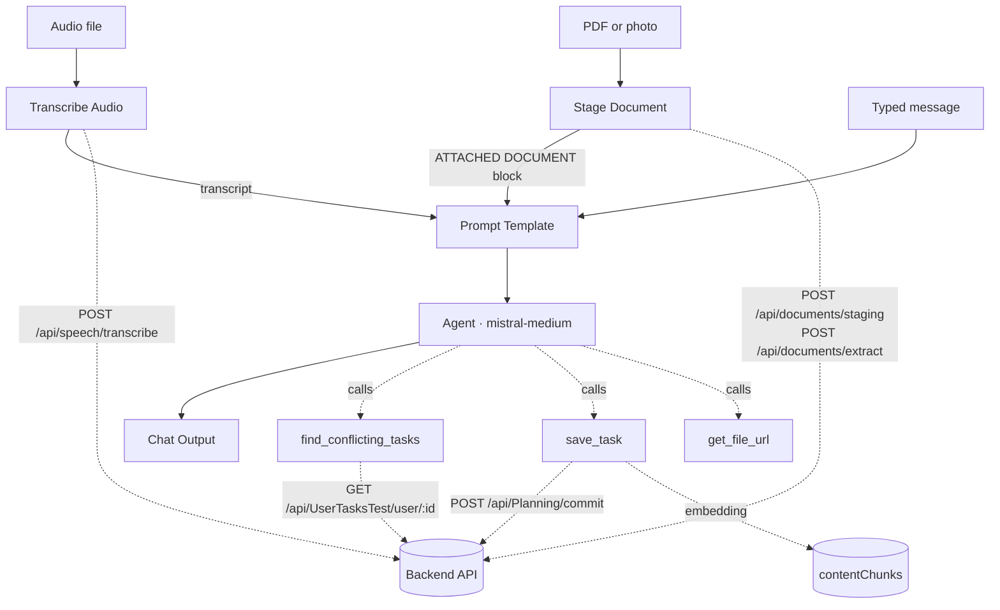
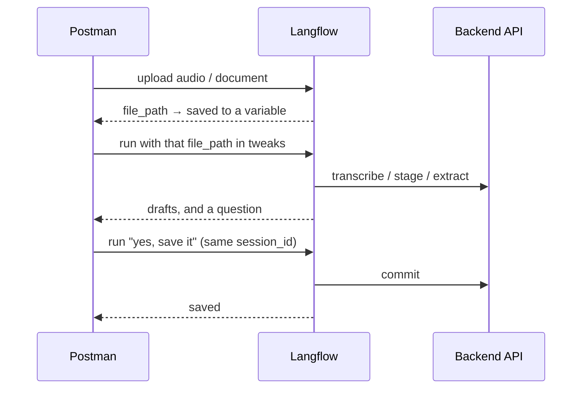

# The AI Flow

Story #30: one entry point for voice, typed text and documents. It drafts tasks, checks
them against what you already have, and saves **only** after you confirm.

Flow id: `b8bc9727-8635-4ab3-875c-942c0fa9d4f1` · Langflow at `http://localhost:7860`

---

## Models

| Job | Model | Where it runs |
|---|---|---|
| Speech to text | `nvidia/nemotron-3.5-asr-streaming-0.6b` | HuggingFace, via our API |
| Reading documents | `global.anthropic.claude-sonnet-4-5-20250929-v1:0` | ITI gateway, via our API |
| The agent (drafts, converses) | `mistral-medium-latest` | Mistral API, inside Langflow |
| Embeddings for search | `BAAI/bge-m3` (1024-dim) | HuggingFace, from Save Task |

Sonnet 4.5 was picked by testing all ten vision models the ITI gateway allows against a
real English invoice and an Arabic electricity bill. Most read English fine and then
invented a document entirely when shown Arabic — Nova Pro reported a birth certificate,
Nova Lite a job application. Only Sonnet got every field right in both languages.

bge-m3 is used because it is genuinely bilingual and 1024-dimensional, which is exactly
what the existing Atlas index expects, so nothing has to be rebuilt.

> The model id needs its `global.` prefix. The bare `anthropic.claude-...` id is not
> approved by the gateway and returns `POLICY_MODEL_NOT_APPROVED`.

---

## The shape of it



The prompt always carries three sections. Any can be empty, and empty means absent:

```
[VOICE TRANSCRIPT]   what they said, already transcribed
[ATTACHMENT]         the ATTACHED DOCUMENT block, if a file was uploaded
[TYPED MESSAGE]      what they typed
```

---

## The five custom components

| Component | Tool name | What it does |
|---|---|---|
| **Transcribe Audio** | — | Uploads the recording, returns the transcript prefixed with `(spoken in ar-EG)` so the agent answers in the right language |
| **Stage Document** | — | Uploads the file, then asks the backend to **read** it. Emits filename, storedPath, contents, due date, amount, issuer |
| **Find Conflicting Tasks** | `find_conflicting_tasks` | Compares one draft against existing tasks — duplicates and time clashes |
| **Save Task** | `save_task` | Commits the task and its document, then writes the embedding |
| **Get File URL** | `get_file_url` | Fresh 15-minute link to a file uploaded earlier |

The first two run on every request. The last three are **tools** — the agent decides
whether to call them.

---

## Endpoints

### Backend (`https://localhost:7276`)

| Endpoint | Used by | Purpose |
|---|---|---|
| `POST /api/auth/login` | all components | Gets a token; cached until it expires |
| `POST /api/speech/transcribe` | Transcribe Audio | WAV/MP3 → text. Send the locale, don't rely on auto-detect |
| `POST /api/documents/staging` | Stage Document | Stores the file **before** confirmation so it can be previewed. Deleted in ~24h if never confirmed |
| `POST /api/documents/extract` | Stage Document | Sonnet reads the file and reports what it says |
| `GET /api/files/read-url` | Get File URL | 15-minute SAS link |
| `GET /api/UserTasksTest/user/{id}` | Find Conflicting Tasks | The list to compare against |
| `POST /api/Planning/commit` | Save Task | Saves task + document together, promotes the blob |

### Langflow (`http://localhost:7860`)

| Endpoint | Purpose |
|---|---|
| `POST /api/v1/files/upload/{flowId}` | Upload audio or a document, returns a `file_path` |
| `POST /api/v1/run/{flowId}?stream=false` | Run the flow |

Both need an `x-api-key` header — since Langflow 1.5 a bearer token is not enough.

**Attaching a file to a run** uses `tweaks`, keyed by node id:

```json
{
  "input_value": "here is my electricity bill",
  "input_type": "chat", "output_type": "chat",
  "session_id": "postman-session-1",
  "tweaks": {
    "StageDocument-tOYga":  { "document_file": "{{documentFilePath}}" },
    "TranscribeAudio-9MiTJ": { "audio_file": "{{audioFilePath}}", "language": "ar-EG" }
  }
}
```

**Reading the reply.** The response repeats the same text five times for backwards
compatibility. Use one path and ignore the rest:

```js
out.outputs[0].outputs[0].results.message.text
```

---

## The Postman collection

Run the folders in order. Folder 1 sets the token and `userId` for everything after it.

| Folder | What it proves |
|---|---|
| **1 – Auth** | Register once, then Login. Do this first |
| **2 – Voice** | Transcription on its own, no AI |
| **3 – Document and photo** | Staging, preview links, and that another user's file gives 403 |
| **4 – Save the task** | The save endpoints directly, with no AI involved — so a failure here is a backend bug, not a prompt bug |
| **5 – The AI flow** | The real thing: upload, then run |
| **6 – Push notifications** | Device registration and a test push |

Folder 5, in order:



`session_id` is what makes turn 2 a reply rather than a new conversation. Keep it the
same across a test, and change it when you want a clean slate.

---

## What a chat looks like

**Turn 1 — you give it something. It drafts and asks. It saves nothing.**

```
you:   remind me to renew my passport friday and pay the electricity bill sunday

agent: 1. Renew passport — 2026-08-14 — Personal — important
       2. Pay electricity bill — 2026-08-16 — Financial — important
       Would you like to save these, or change anything?
```

**Turn 2 — you confirm. Now it saves, one task at a time.**

```
you:   yes, save it
agent: Saved "Renew passport", due 2026-08-14. Next: pay the electricity bill?
```

Rules the agent follows:

- **Answers in your language.** Egyptian Arabic in, Egyptian Arabic out — judged from the
  message it is replying to, not from earlier turns.
- **Splits multi-action input.** "Go swimming, pay the bills and text Ahmed" is three tasks.
- **Never invents a due date.** No date stated → it asks. A task with no due date can't
  produce a reminder, so it isn't saved.
- **A past due date is fine** and gets saved as overdue.
- **The document outranks your description.** Caption a hospital invoice "my electricity
  bill" and it says so and goes with the document.

---

## Notes and known limits

**The agent doesn't reliably call `find_conflicting_tasks`.** The tool works — tested
directly, it finds all 11 duplicates of "Renew my passport" — but mistral-medium usually
skips it and reports no conflicts. If it says "conflicts: not checked", believe that
rather than a clear result. Worth trying `mistral-large` before the demo.

**It also omits arguments it just displayed.** A draft shown as "important" was arriving
at `save_task` with no priority at all. Missing priority is now derived from the due date
(overdue or inside 48h → urgent) rather than silently defaulting to normal.

**Duplicates across languages are missed.** "Renew my passport" and "تجديد الباسبور" are
the same task and the checker sees no relation, because it compares word overlap. Fixing
it properly means comparing bge-m3 embeddings.

**A turn takes 5–11 seconds** — longer than NFR-1's 5s, and document runs add the time
Sonnet needs to read the file.

**Rate limits.** HuggingFace and Mistral free tiers both throttle. Mistral returned
"service tier capacity exceeded" during testing. Don't discover this during the demo.

**Voice recordings must be WAV or MP3.** The provider rejects AAC/M4A, so an iPhone voice
note needs converting first.

**Editing a component** means editing `langflow/components/*.py` and pushing it into the
running Langflow — the files are not watched. Re-importing the flow also works but wipes
every configured secret and renames the nodes, which breaks the `tweaks` ids above.
